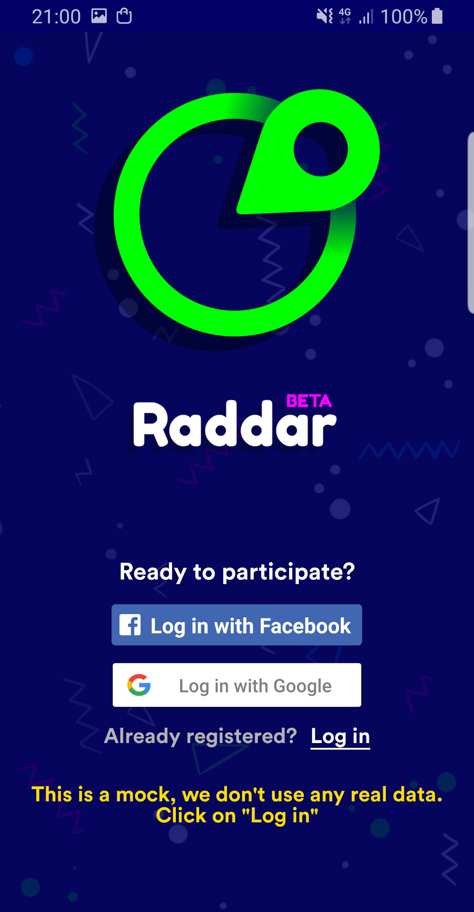
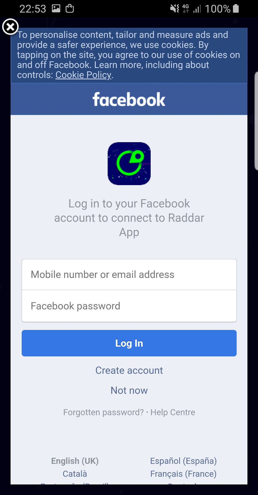
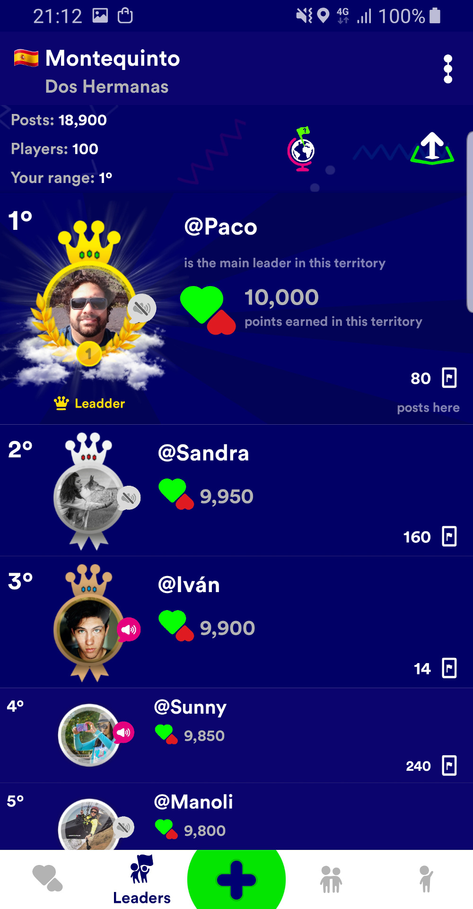
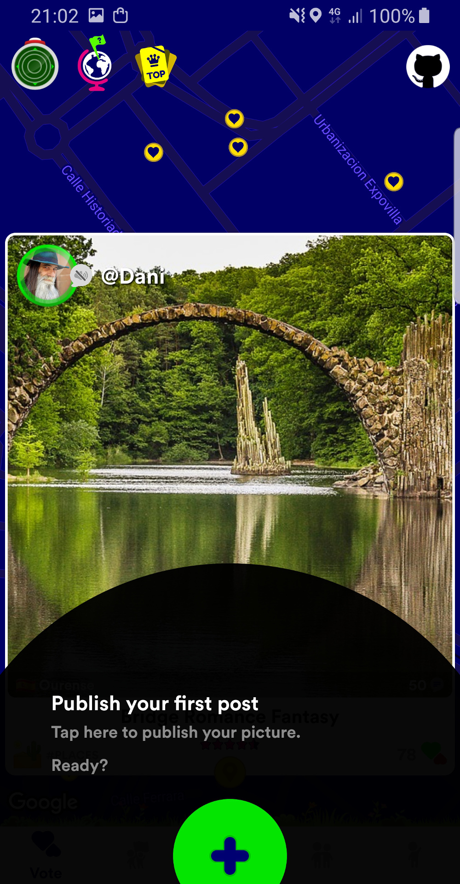

# Raddar
Raddar is the first social app where your publications could die. Your publication could die or can be leaders of the world ranking. Swipe up or swipe down every publication you find in your Raddar. Your votes and the votes of the entire community will decide if the publications survive or die forever.

This app was the product of a Startup from Seville (Spain) called Kreomi that did not work in the market. We made this application in our free time after work. We started in 2016 and finished in 2018.

    This project is deprecated
    We do not save any data, all data are mocks
    Mock images from https://pixabay.com
    Mock comments
    All our servers are down
    Fabric and Firebase are active for usage statistics
    You can see the source code and more information on GitHub
    If you have any question do not hesitate to contact us at raddarapp@gmail.com

❤️ THANK YOU TO EVERYONE WHO COLLABORATED WITH US ❤️

## Summary

* Architecture
  * My own Clean Architecture with MVP using [Rosie][1] framework
  * Separate Android Framework and Java in <b>android</b> and <b>general</b> packages respectively to promote the backend developers can add new features
* Features
  * Login with Google, Facebook and user & pass
  * Splash, Welcome and Tutorial screens
  * Maps, manage geolocation, draw areas and detect fake location
  * Create and delete a geolocated publication
  * Vote publication with swipe up/down
  * Crop, rotate and zoom images
  * Create comments
  * Save favourite publications
  * Fabric and Firebase for usage statistics
  * Push notifications with Firebase
  * Profile settings
  * Record and reproduce audio
  * Animations and sounds

## Others

* <b><u>VERY IMPORTANT</u>: To launch this project, use the "debugFake" Build Variant</b>
* This project is a <b>Beta</b>, some features are not implemented. For example, edit a publication, follow users, delete comments, report a publication and so on
* This project is <b>deprecated</b>, we started in 2016 and we have not tested devices with Android >= 8.0
* All the keys and the google-services.json are fake except google map api key for debugs build variants
* Tests are incompleted. There are some deprecated instrumentation tests with MockWebServer
* The idea of the empty interfaces, packages organization, all the Activities with a Fragment and so on, was to homogenize the development for the backend developers. So, they could add new features easily
* We ❤️ Kotlin but in this old project we used Java 😭
* We ❤️ testing but for this product made in our free time after work... Sorry! 🙏 Moreover, you will see later a lot of changes in previous versions of Raddar, so create a new test each week it did not make sense 😅
* We ❤️ Clean Code & Clean Architecture but it is not always possible. Be pragmatic! ✌️

## Screens

### Splash & Welcome

  
  
  

  
  
  

### Login

  
  
  

  
  

### Footprints & Rankings

  
  
  

  
  
  

### Create Footprint

  
  
  

  

### Territories

  
  
  

  

### Profiles

  
  
  

### Profile Settings

  
  
  

  
  

### Crop & Rotate & Zoom Images

  
  
  

  

### Tutorial

  
  
  

  
  
  

  
  

### Others

  
  
  

## Libraries used in this project

* [Rosie][1]
* [Renderers][2]
* [Okhttp][3]
* [Retrofit][4]
* [Picasso][5]
* [Dagger][6]
* [Butterknife][7]
* [RoundedImageView][8]
* [TransitionImageView][9]
* [MockWebServer][10]
* [ApacheCommonsIO][11]
* [Calligrahy][12]
* [Opus][13]
* [RxAudio][14]
* [TapTargetView][15]
* [PhotoView][16]
* [PageIndicatorView][17]
* [StickySwitch][18]
* [Pulsator4droid][19]
* [CustomActivityOnCrash][20]
* [CircularImageView][21]
* [FloatingView][22]
* [Emoji][23]
* [Fabric][24]
* [Firebase][25]
* [Facebook SDK][26]
* [Google Play Services][27]
    * Maps
    * Maps Utils
    * Location
    
License
-------

    Copyright 2018 Fernando Franco Giráldez
    Licensed under the Apache License, Version 2.0 (the "License");
    you may not use this file except in compliance with the License.
    You may obtain a copy of the License at

       http://www.apache.org/licenses/LICENSE-2.0

    Unless required by applicable law or agreed to in writing, software
    distributed under the License is distributed on an "AS IS" BASIS,
    WITHOUT WARRANTIES OR CONDITIONS OF ANY KIND, either express or implied.
    See the License for the specific language governing permissions and
    limitations under the License.    

[1]: https://github.com/Karumi/Rosie
[2]: https://github.com/pedrovgs/Renderers
[3]: https://github.com/square/okhttp
[4]: https://github.com/square/retrofit
[5]: https://github.com/square/picasso
[6]: https://github.com/square/dagger
[7]: https://github.com/JakeWharton/butterknife
[8]: https://github.com/vinc3m1/RoundedImageView
[9]: https://github.com/vikramkakkar/ImageTransition
[10]: https://github.com/square/okhttp/tree/master/mockwebserver
[11]: https://github.com/apache/commons-io
[12]: https://github.com/chrisjenx/Calligraphy
[13]: https://github.com/louisyonge/opus_android
[14]: https://github.com/Piasy/RxAndroidAudio
[15]: https://github.com/KeepSafe/TapTargetView
[16]: https://github.com/chrisbanes/PhotoView
[17]: https://github.com/romandanylyk/PageIndicatorView
[18]: https://github.com/GwonHyeok/StickySwitch
[19]: https://github.com/booncol/Pulsator4Droid
[20]: https://github.com/Ereza/CustomActivityOnCrash
[21]: https://github.com/Pkmmte/CircularImageView
[22]: https://github.com/UFreedom/FloatingView
[23]: https://github.com/vanniktech/Emoji
[24]: https://get.fabric.io/
[25]: https://firebase.google.com/docs/android/setup
[26]: https://developers.facebook.com/docs/android/componentsdks
[27]: https://developers.google.com/maps/documentation/android-sdk/start
